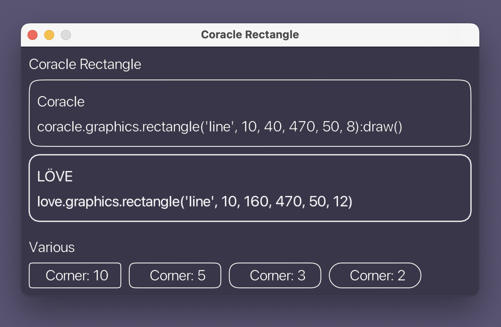
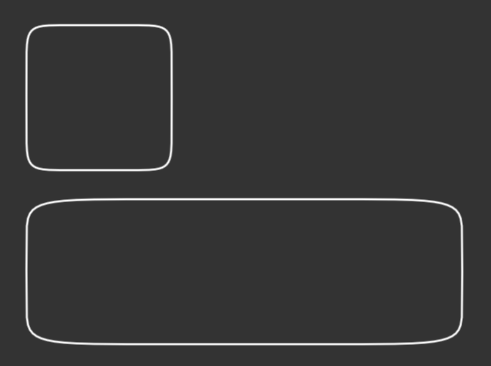

# Coracle Rectangle

An implementation of the superellipse algorithm to render corner radii on a rectangle. It might seem too subtle to matter but user interfaces feel much cleaner when using this rounded rectangle implementation.

## Background

I noticed something off when creating buttons using LÖVE's default rectangle rendering. From the source you can see that each corner is just a quarter circle: [Graphics::rectangle](https://github.com/love2d/love/blob/main/src/modules/graphics/Graphics.cpp#L1351) 

A better shape to use is a [Superellipse](https://en.wikipedia.org/wiki/Superellipse).

* [Apple's Buttons guidelines](https://developer.apple.com/design/human-interface-guidelines/components/menus-and-actions/buttons/)
* [Desperately seeking squircles](https://www.figma.com/blog/desperately-seeking-squircles/)
* [Rounded Corners in the Apple Ecosystem](https://medium.com/minimal-notes/rounded-corners-in-the-apple-ecosystem-1b3f45e18fcc)

## Coracle Rectangle

Coracle Rectangle is a superellipse implementation where the corners are calculated using the shortest rectangle side for both vertical and horizontal curves. Scroll to the bottom of this readme to see why this is necessary. The class uses the same object syntax as the Playdate SDK which in turn is derived from 'replayism.com/code/barebones-lua-class' (now offline) but should be easily adaptable to whatever Lua object system you use.


Sourcecode for this example is at [main.lua](main.lua)

## Performance

I don't know what the LÖVE conventions are for optimising and minimising redraws. This implementation uses the same object structure as Playdate, the algorithm calculates the vertices on creation, draw only happens in `:draw()` or `:drawPolygon()`. This way you can have a Rectangle object and reduce the workload per frame. In a sprite system this could be taken further with the rendering done once to an image/canvas. The `coracle.graphics.rectangle(...):draw()` syntax is a convenience but it creates a new object every frame, instead do something like:

```lua
require 'Coracle/Shapes/rectangle'
local rectangle = Rectangle('fill', 10, 10, 50, 20, 5)

-- or
require 'Coracle/coracle'
local rectangle = coracle.graphics.rectangle('fill', 10, 10, 50, 20, 5)

function love.draw()
	rectangle:draw()
end
```

The default method to draw is `:draw()` - this draws a pre-rendered canvas object and when using with `'line'` will only draw the line width at the time the object was created. If you are dynamically setting line width within the main draw loop you can instead render the polygon from the vertices using `:drawPolygon()` - this suffers from a slight blurriness/anti-aliased overdraw that all render-to-screen operations seem to have in LÖVE (see the native LÖVE text and rectangle in the screenshot above).

<hr>

## Superellipse

A superellipse, showing why it's not suitable for user interfaces without some extra work, looks perfect as a square, but a rectangle looks squashed:


